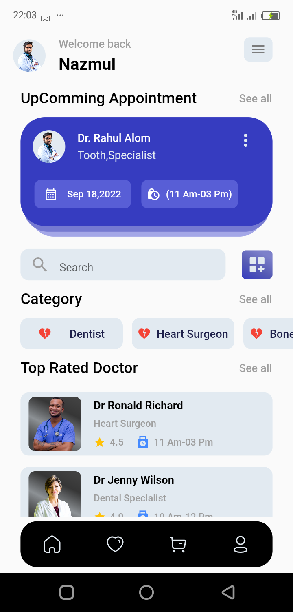
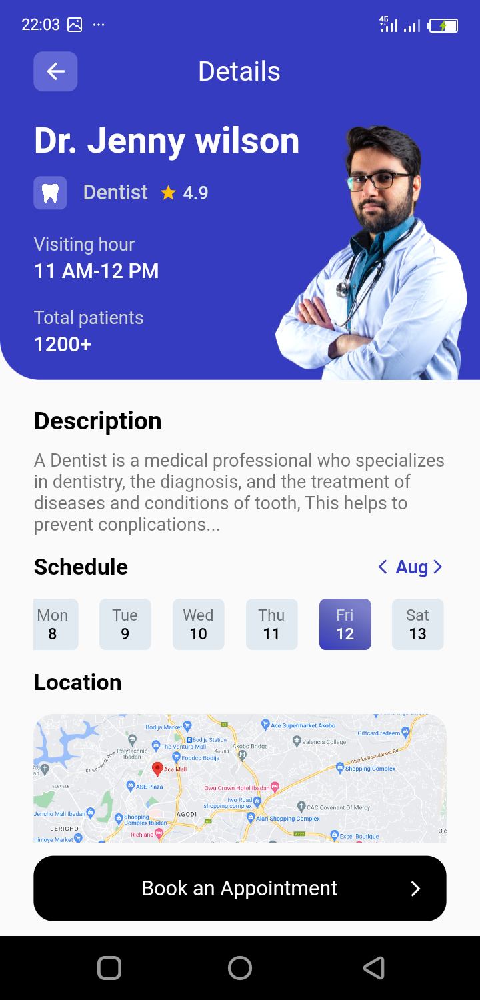

# Medical Mobile App

You can access the apk file here
- [Medical Flutter Apk](https://drive.google.com/file/d/1FAWQ6IXqQ7S2Q_L378fLptcbVzHZIN0N/view?usp=sharing)

## Below are the screenshot of the three screen

